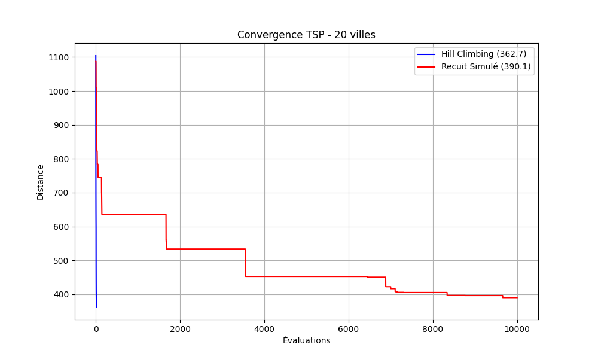
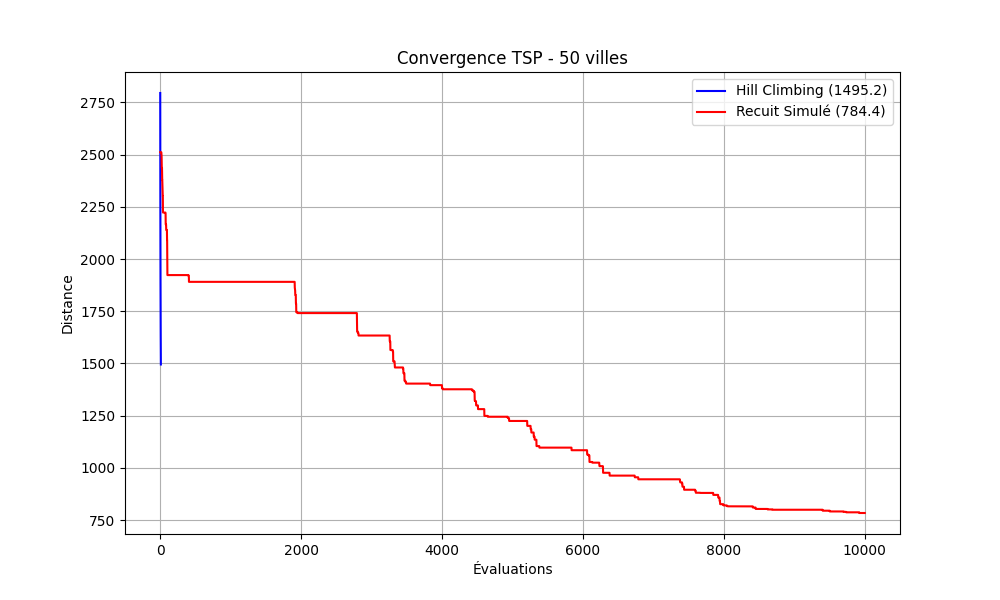

# 🌍 Projet M1 : Comparaison de Métaheuristiques pour le TSP


> **Université Hassan II de Casablanca - ENSET Mohammedia** > **Master :** SDIA (Sciences des Données et Intelligence Artificielle)  
> **Module :** Optimisation & Métaheuristiques  
> **Encadrant :** Prof. MESTARI  

### 👥 Réalisé par :
* **Essayouti Atiqa**
* **Timourti Sana**
* **Misbah Kaoutar**

---

## 📝 Description du Projet

Ce projet vise à résoudre le célèbre **Problème du Voyageur de Commerce (TSP)** en comparant deux approches d'optimisation :
1.  **🏔️ Hill Climbing (Best Improvement)** : Une méthode de recherche locale simple.
2.  **🔥 Recuit Simulé (Simulated Annealing)** : Une métaheuristique capable d'échapper aux optimums locaux.

L'objectif est d'analyser leur performance sur des instances de 20 et 50 villes.

---

## 📊 Résultats Clés (Instance 50 Villes)

Nos expérimentations montrent que le **Recuit Simulé** est nettement supérieur pour les grandes instances :

| Algorithme | Meilleur Coût (Distance) | Temps d'exécution (s) |
| :--- | :--- | :--- |
| **Hill Climbing (Best)** | 1495.21 | 0.44s |
| **Recuit Simulé** | **784.40** 🏆 | 0.47s |

> **Analyse :** Le Recuit Simulé surpasse le Hill Climbing de près de **47%** en termes de qualité de solution pour l'instance de 50 villes.

---

## 📈 Courbes de Convergence

Les graphiques suivants montrent l'évolution de la distance totale au fil des itérations.

### 🔹 Instance A (20 Villes)


### 🔹 Instance B (50 Villes)
Le Hill Climbing stagne rapidement (optimum local), tandis que le Recuit Simulé continue d'explorer pour trouver de meilleures solutions.


---

## ⚙️ Installation et Exécution

### 1️⃣ Cloner le projet
```bash
git clone [https://github.com/atiqaessayouti/TSP-Projectt.git](https://github.com/atiqaessayouti/TSP-Projectt.git)
cd TSP-Projectt

